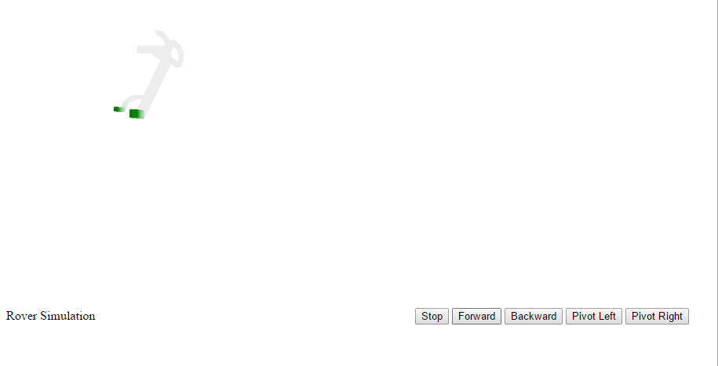

# Rover Simulation
Simulation environment for the RSX rover that supports the sensors and command interface used on the actual rover.
The basic simulation code has two parts:
- a server that handles commands to and from the simulation (in the aptly named `server` folder)
- a browser-based client for visualizing the output of the simulation. This client also has buttons for controlling the simulation.

Any other client simply needs to make API calls to `localhost:8080`. Multiple clients can be connected to the simulation environment.

### Installation:
- `git clone https://github.com/rsx-utoronto/simulation.git`
- `npm install`
- `cd simulation`
- `npm start`

In your browser, navigate to `localhost:8080/frontend`

### API Documentation
##### PUT
- `/drive/speed/:speed` - Send the rover forward, unit is metres per second
- `/drive/pivot/:pivot` - Pivot the rover on the spot, unit is degrees per second
- `/drive/stop`

##### GET
- `/gps` - Returns the GPS coordinates of the rover as a JSON object with keys lat, lon and head. For now, they're always centred around UTIAS
- `/lidar` - Returns the results of sweeping the lidar around the front of the rover as a JSON object, containing a list of {angle: distance} pairs, e.g. {-20: 20}. Angles are in degrees, distances are in metres. Returns -1 if the lidar returns 0.

Here's a demo of it working:

